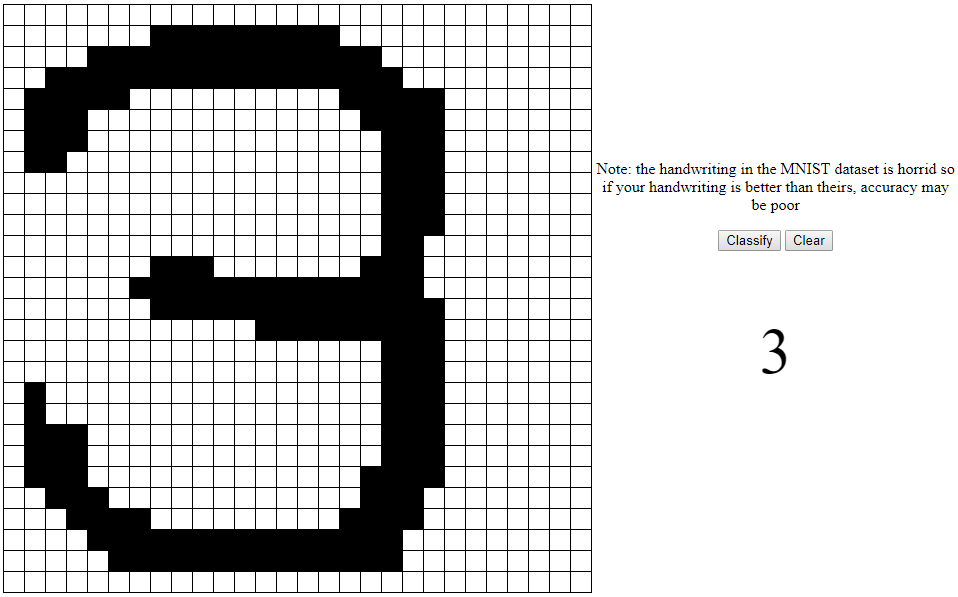

# NaiveBayesJS
A JavaScript Naive Bayes image classifier

## NOTE TO READER
This entire program was written in very short order (roughly 5 hours) so some of the coding in the drawing side is very hacked together and not well documented, structured, or formatted. Most of the design time was spent on the actual Machine Learning algorithm, not the random drawing application I threw in at the last second for fun.

## Normal
Normal mode simply runs each image in the test set one by one and spits out the statistics as it goes as well as the current specimen.

## Draw
Lets the user draw a number and then it tries to classify the number, fickle due to center of mass vs boundary centering and the fact the MNIST data set has bad handwriting. For best results, use handwriting as similar as possible to the MNIST set.

  

